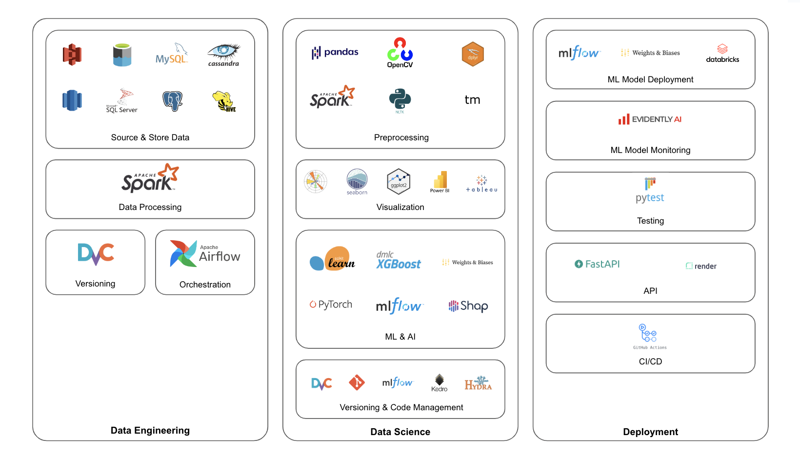

## Welcome to my GitHub Profile Page 👋
.png)

## About Me
- 🔭 I focus in data science, machine learning, and business analytics.
- 🖥 I mainly code in Python, SQL, and R.
- 💼 I have over 2 years of experience as a data & analytics consultant where I supported MLOps implementation, data automation, data management, and digital transformation projects.
- 🎓 I studied Actuarial Science in Heriot-Watt University, under the School of Mathematical & Computer Sciences, and am currently doing a Master's in Business Analytics at Nanyang Business School, in Nanyang Technological University.
- 📍 I'm currently based in Singapore.
- 🔗 For more details, visit [my Linkedin profile](https://www.linkedin.com/in/gianatmaja/).

## Competencies
### Technical

### Business

## Tech Stack

## Connect with Me
Feel free to reach out to me via Linkedin or by Email!

